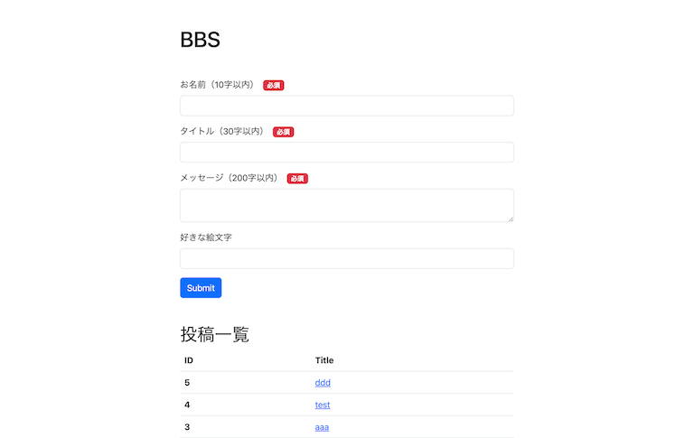

# simple-bbs

バックエンドに AWS Lambda + DynamoDB を使用した掲示板のサンプルです。



### 利用する技術

- AWS
  - Lambda
  - DynamoDB
  - S3
  - CloudFront
- Nuxt 3
- TypeScript
- Bootstrap v5
- Zod
- AWS SDK for JavaScript v3

## 1. git clone & パッケージのインストール

このリポジトリを作業するフォルダにダウンロード、または `git clone` してください。

```
$ git clone https://github.com/mthkx/simple-bbs.git
```

必要なパッケージをインストールします。

```
$ npm install
```

## 2.環境変数の設定

`.env.production` ファイルをルート直下に作成します。

```
NUXT_AWS_ENDPOINT_URL_DYNAMODB=https://dynamodb.ap-northeast-1.amazonaws.com（東京リージョンの場合）
NUXT_AWS_ACCESS_KEY_ID=（IAMユーザーのアクセスキー）
NUXT_AWS_SECRET_ACCESS_KEY=（IAMユーザーのシークレットアクセスキー）
```

ローカル環境で動作確認する場合は`.env.development`ファイルを作成して、使用する DynamoDB 互換データベースに応じた設定をしてください。

```
# 例：LocalStackの場合
NUXT_AWS_ENDPOINT_URL_DYNAMODB=https://dynamodb.localhost.localstack.cloud:4566
NUXT_AWS_ACCESS_KEY_ID=dummy
NUXT_AWS_SECRET_ACCESS_KEY=dummy
```

## 3.DynamoDB の設定

以下の通りにテーブルを作成してください。

| 項目             | 設定内容   |
| ---------------- | ---------- |
| テーブル名       | simple-bbs |
| プライマリーキー | id         |
| 型               | 数値       |

続いて連番を採番するためのテーブルを作成します。

| 項目             | 設定内容       |
| ---------------- | -------------- |
| テーブル名       | atomic-counter |
| プライマリーキー | tableName      |
| 型               | 文字列         |

次に`atomic-counter`テーブルに項目を追加します。  
プライマリーキー"_tableName_"の値に"simple-bbs"と入力  
属性としてキー名を"_seq_"、数値型に設定し、値に 0 を入力してください

| tableName  | seq |
| ---------- | --- |
| simple-bbs | 0   |

このようにテーブルに反映されていれば完了です。

## 4.（ローカル環境で動かす）

以下のコマンドで動作確認ができます。

```
$ npm run dev
```

## 5.ビルド

以下のコマンドを実行します。

```
$ npm run build
```

ルート直下の`.output`フォルダにビルドしたファイルが出力されます。
